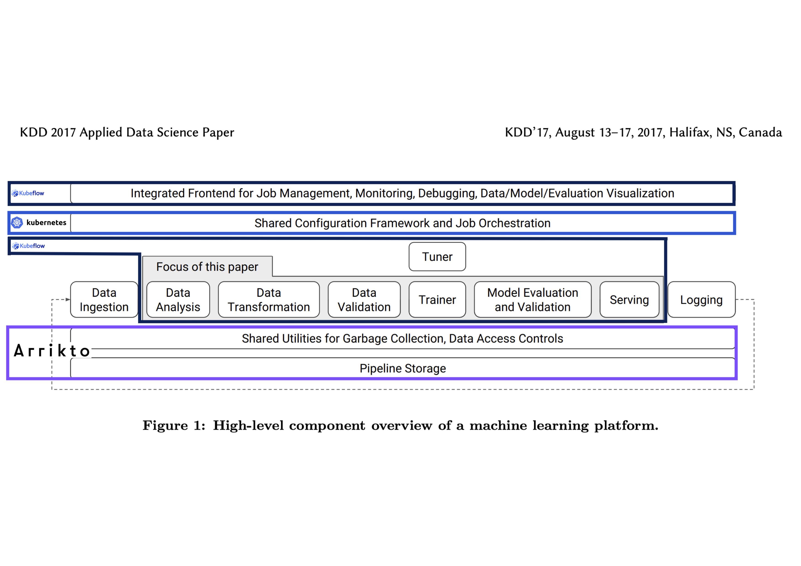
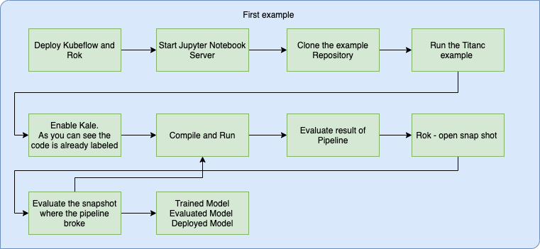
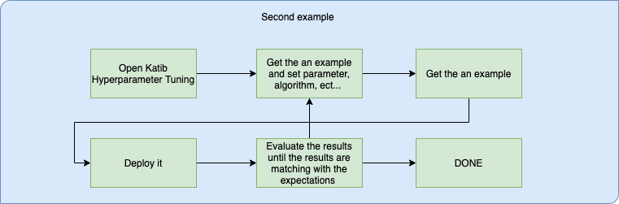

# Architecture and Workflow
What is the structure of this repository?

In the `master` branch you can find a general overview of the Kubeflow-example. \
In the `codebase` branch you can find the codebase for this example. \
In the `kubeflow.dashboard` branch you can find how to setup Kubflow in two different ways.

## About
This repository was created while writing my bachelor thesis. The topic of my bachelor thesis is about evaluating the process of CI/CD in the aspect of a data scientist. I evaluated five CI/CD platforms and implemented one of them on a server.
I evaluated the following platforms:
* Kubeflow
* CML
* MLFlow
* Cortex \
About me: I am studying at the technical university of Vienna.

## Architecture
The architecture I  am going to use is the architecture published in the paper `KDD 2017 Applied Data Science Paper` with the title `TFX: A TensorFlow-Based Production-Scale Machine Learning Platform`. It is worth to have a peek ;) [Paper](https://dl.acm.org/doi/pdf/10.1145/3097983.3098021)

First of all, one needs to know what components to use. Basically, I am using three main components as you can see in the figure.
I annotated the architecture from the original paper so you can see where the components are.
* Kubeflow
* Kubernetes
* Arrikto 

Kubeflow has many tools but I will only discuss the ones which I am going to use, starting with the dashboard. The dashboard gives the user an overview of the main tools like `Home` , `Pipelines` , `Notebook Servers`, `Katib` , `Artifact Store`.  

The Kubeflow Pipeline is for building and deploying portable, scalable machine learning (ML) workflows based on docker containers.

The notebook server is an IDE for writing the ML codebase. In my case, I am also including [Kale](https://github.com/kubeflow-kale/kale). Kale is a project that aims at simplifying the data science experience of deploying Kubeflow pipelines workflows. Kale enables the user to label their code, so the pipeline knows what to do with that part of code. 

Katib is the hyperparameter tuner and is located in the second Kubeflow section as a tuner. 

The last feature which I am going to use is the Snapshot Store. This service is provided by Rok. Rok is a data management product that allows you to snapshot, version, package, distribute, and clone your full environment along with its data. [Rok](https://journal.arrikto.com/arrikto-launches-rok-and-rok-registry-93d76eb0c3a2). 

## Workflow
In  this section we are going to see how those Kubeflow examples will look like. For this I have prepared two figures.

