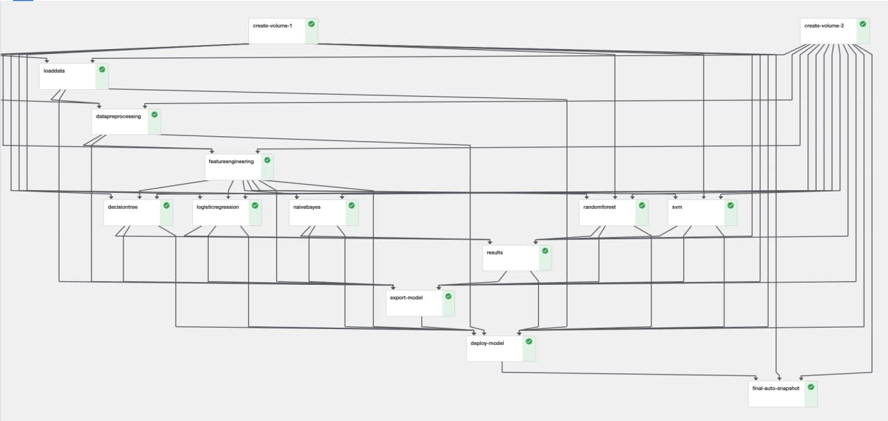

# Kubeflow Kale Examples

This repository contains curated examples to showcase Kubeflow Kale

## Start a Juypter Notebook Server
Open the dashboard after installing minikf and open Notebook Server. 
Then choose ` NEW SERVER `. 
It is crucial that you set the following attributes for the new juypter server: 

* Custom Image
` gcr.io/arrikto-public/tensorflow-1.14.0-notebook-cpu:kubecon-workshop `
* Data Volumes
` Name: data `
So the path of the Volume is ` /home/jovyan/data `

All other attributes can be left as they are.

## Juypter Notebook

* Clone this repository into the ` data ` directory using the terminal. The terminal can be started in the ` launcher ` view. 
` git clone https://github.com/Tokko55v2/kubeflow-example.git -b codebase `

After cloning, you can start running your Kubeflow Pipeline right away .
You can do that when you click on the kubeflow icon. 
Enable the Kale Deployment Pipeline, choose ` new Experiment ` and any pipeline name and description. 
Compile and Run!

Sidenote: you will probably run into some issues, so start the ` titanic_dataset_ml.ipynb ` before you run the pipeline.
To install the requirments use ` pip `.

The Pipeline will also thrown an error in the section ` deploy_model ` because it will try to connect to a server to start a script. 
The scipt starts a docker container with the new model.

The successfully running pipeline should look like this:

