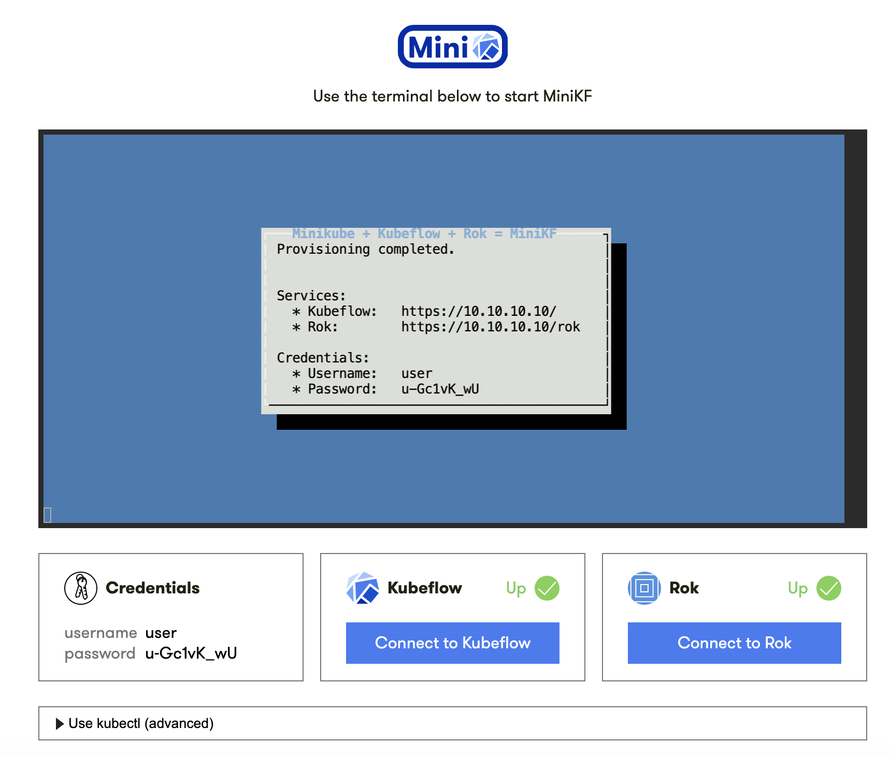

# Setup Kubflow in two diffrent ways
This tutorial shows you how to setup MiniKF with Rok and also how to setup MicroK8s. The first setup is Minikf followed by MicroK8s.

# Setup - MiniKF - Rok

MiniKF is a fast and easy way to deploy Kubeflow on your laptop or server.

## There are some system requirements that are needed for the installation:
* minimum 12 GB RAM
* 2 CPUs
* 50 GB disk space

## Operating systems:
* Linux
* macOS
* Windows

## Prerequisities for installing MiniKF
* [Vagrant](#Install-Vagrant) 
* [Virtuell Box](https://www.virtualbox.org/wiki/Downloads)

### Install MiniKF
1. Initialization of the Vagranfile. This file contains all specifics for your VM. [More later on](#Install-Vagrant). 
```
$ vagrant init arrikto/minikf
$ vagrant up
```
This process will take a while depending on your system. In my case, I had to wait for around 10 minutes.  After 10 minutes, the terminal should give you the address where MiniKF is available.
The message should look like that:
```
Welcome to MiniKF!
Visit http://10.10.10.10/ to get started.
```
Open the link and follow the introductions. The image below shows how it should look like after Rok and Kubeflow are launched.


Let's have fun! - An example is on the codebase branch.

### Install Vagrant
Vagrant is a tool for building and managing virtual machine environments in a single workflow.
1. Download the latest version of vagrant
```
$ curl -O https://releases.hashicorp.com/vagrant/2.2.10/vagrant_2.2.10_x86_64.deb
```
2. Update the machine and install vagrant
```
$ sudo apt update
$ sudo apt install ./vagrant_2.2.10_x86_64.deb
```
After the initialization of vagrant (step `vagrant init arrikto/minikf` ), check the `Vagrantfile`. It might be necessary to set the RAM hardcoded to 12Gib because the RAM value is dynamically set by vagrant and in case your system has only 14 GiB vagrant will set it to 10Gib probably.
* Set RAM value
```
config.vm.provider "virtualbox" do |vb|
    vb.name = "Name" # friendly name that shows up in Oracle VM VirtualBox Manager
    vb.memory = 12000 # memory in megabytes
    vb.cpus = 2 # cpu cores, can't be more than the host actually has!
end
```
* [Optional] Can set a password and username
```
# enable logging in via ssh with a password
 config.ssh.username = "vagrant"
 config.ssh.password = "vagrant"
```

## Install MiniKF
Create a folder named minikf and open it. In this folder create a vargrantfile.
```
$ mkdir minikf
$ vagrant init arrikto/minikf
```

# Setup - MicroK8s
## Setup - Debian

MicroK8s is a small, fast and fully-conformant Kubernetes that tracks upstream release and makes clustering trivial. MicroK8s is great for offline development, protoyping and testing. In this tutorial I will install MicroK8s on a Debian system, if you want to install it on a macOS or Windows I would recommand to use multipass but more about that in the Setup -  macOS.

### First install MicroK8s on Debian
1. Install MicroK8s on Linux
```
$ sudo snap install microk8s --classic
```
2. check the status while Kubernetes starts
```
$ microk8s status --wait-ready
```
3. Add your user to the Micro8Ks group created by Micro8Ks
```
$ sudo usermod -a -G microk8s $USER
$ sudo chown -f -R $USER ~/.kube
```
4. Deploy Kubeflow
```
$ sudo microk8s.enable dns dashboard storage
```
5. Start Kubeflow
```
$ sudo microk8s.enable kubeflow
```
In case your system has not the recommandet 14 RAM you can use this command to disable the recoomandation:
```
$ KUBEFLOW_IGNORE_MIN_MEM=true microk8s.enable kubeflow
```
Task five will take a while depanding on your system. The output should look like that:
```
Operator pods ready.
Waiting for service pods to become ready.
Congratulations, Kubeflow is now available.

The dashboard is available at http://10.64.140.43.xip.io

    Username: admin
    Password: {PW}

To see these values again, run:

    microk8s juju config dex-auth static-username
    microk8s juju config dex-auth static-password

To tear down Kubeflow and associated infrastructure, run:

    microk8s disable kubeflow
```

6. Shut Down Kubeflow
```
$ sudo microk8s disable kubeflow
```
## Accessing the Kubeflow dashboard
When running MicroK8s on Windows, macOS, Multipass or a virtual machine, you need to create a SOCKS proxy to access the Kubeflow dashboard:

1. Logout from the current session in your terminal using the `exit` command.
2. Re-establish connectionn to the machine using `SSH`, enabling SOCKS proxy with the `-D 8080` parameter.
On Windows, macOS or Multipass, you can check for the IP first with:
```
$ multipass list` 
```
and then, run this command, replacing <multipass_public_ip> with that IP:
```
$ ssh -D 8080 -C -N [username | multipass]@<public_ip> -p PORT
```
3. In your host operating system, go to Settings > Network > Network Proxy, and enable SOCKS proxy pointing to: 127.0.0.1:8080
4. Finally, access the Kubeflow dashboard by:
* Opening a new web browser window.
* Accessing the link provided after you have enabled Kubeflow ( for example, `10.64.140.43.xip.io`)

